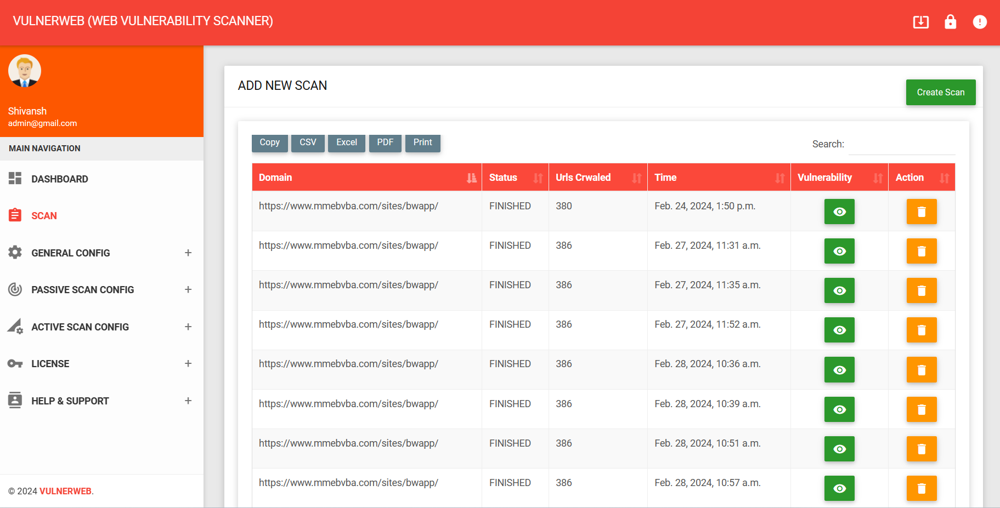
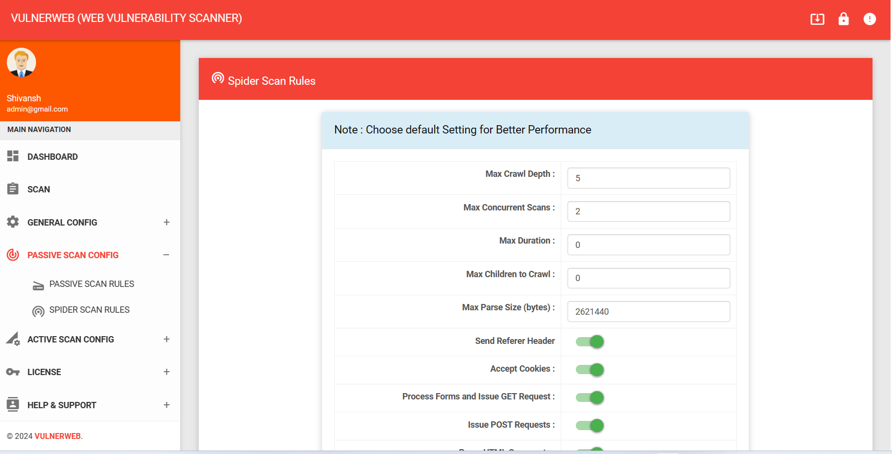
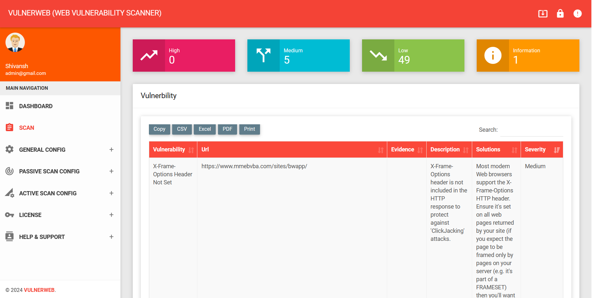
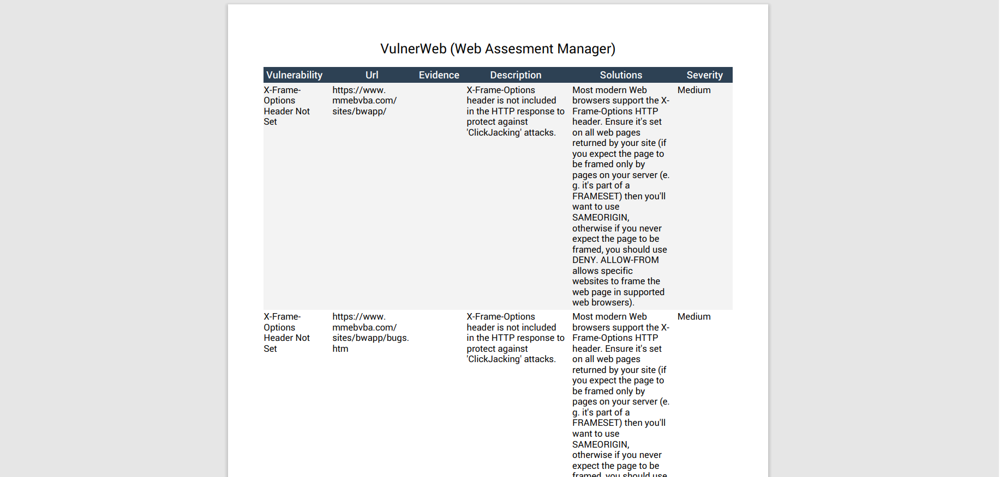

# VulnerWeb
Scan the Websites and Web Applications outside-in and identifies the vulnerabilities and security issues within them in the running State. It runs on operating code to detect issues within interfaces, requests, response, scripting, data injection, sessions, authentications, and more.
# Features

  <a href="#dashboard">Dashboard</a> •
  <a href="#scan">Scan</a> •
  <a href="#General-Config">General Configuration:</a> •
  <a href="#attack">Active & Passive Attack</a> •
  <a href="#Reports">Reports</a> •

<h2 id="dashboard">DASHBOARD
  

  <h4>Centralized dashboard for monitoring scans, vulnerabilities, targets, and analytics.</h4>
  
  <h3>Features</h3>
  
  1. Real-time scan monitoring  
  2. Vulnerability overview  
  3. Severity-based analytics  
  4. Historical tracking  
  5. Target management  
 

<h2 id="scan">SCAN
  

  <h4>The scanning engine performs automated vulnerability assessments against live web applications.</h4>
  
  <h3>Scan Capabilities</h3>
  
  1. SQL Injection Detection  
  2. Cross-Site Scripting (XSS)  
  3. CSRF Analysis  
  4. Directory Enumeration  
  5. API Security Checks  
  6. Security Header Analysis  
 

<h2 id="General-Config">GENERAL CONFIGURATION
  

  <h4>Customize scanning behavior and security assessment rules.</h4>
  
  <h3>General Configuration</h3>
  
  1. Custom Headers  
  2. Authentication Tokens  
  3. Proxy Support  
  4. Rate Limiting  
  5. Crawl Depths  
  6. Exclusion Rules  
 

<h2 id="attack">ATTACK
  

  <h4>Supports both passive and active attack methodologies..</h4>
  
  <h3>Passive Analysis</h3>
  1. Cookie Analysis  
  2. Header Inspection  
  3. SSL/TLS Validation  
  4. Technology Fingerprinting  
 
  <h3>Active Analysis</h3>
  1. Payload Injection  
  2. Parameter Fuzzing  
  3. Form Manipulation  
  4. Session Attacks  

<h2 id="Reports">REPORT
  

  <h4>Generate professional vulnerability assessment reports.</h4>
  
  <h3>Supported Formats</h3>
  
  1. PDF Reports 
  2. JSON Reports  
  3. HTML Reports  
  4. CSV Reports  
  
 

