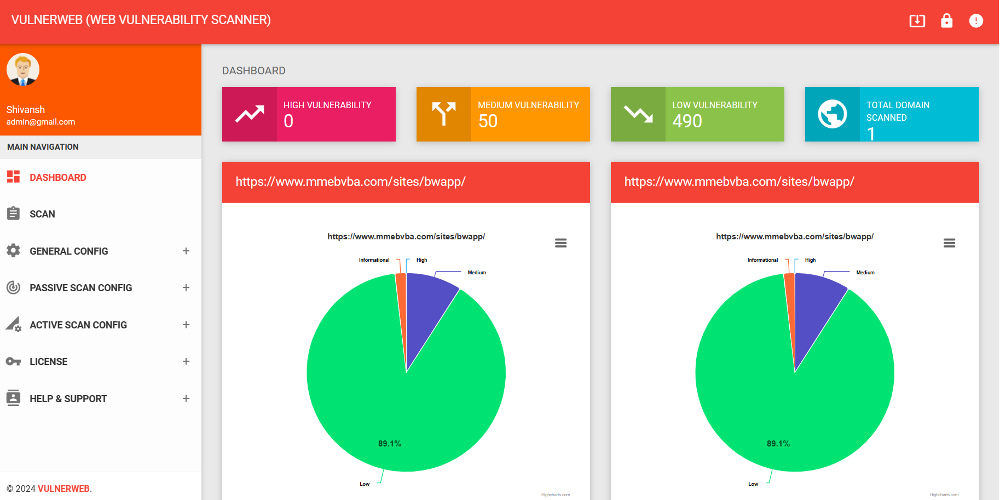

# VulnerWeb
Scan the Websites and Web Applications outside-in and identifies the vulnerabilities and security issues within them in the running State. It runs on operating code to detect issues within interfaces, requests, response, scripting, data injection, sessions, authentications, and more.
# Features

  <a href="#dashboard">Dashboard</a> •
  <a href="#scan">Scan</a> •
  <a href="#General-Config">General Configuration:</a> •
  <a href="#attack">Active & Passive Attack</a> •
  <a href="#license">License</a> •

<h2 id="dashboard">DASHBOARD
  

  <h4>Centralized dashboard for monitoring scans, vulnerabilities, targets, and analytics.</h4>
  
  <h3>Features</h3>
   
  1. Real-time scan monitoring  
  2. Vulnerability overview  
  3. Severity-based analytics  
  4. Historical tracking  
  5. Target management  
 
